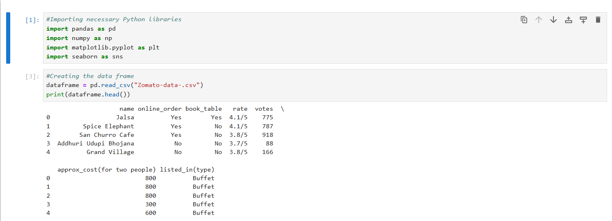
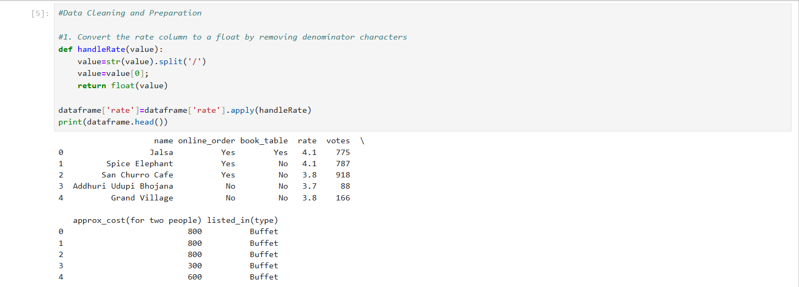
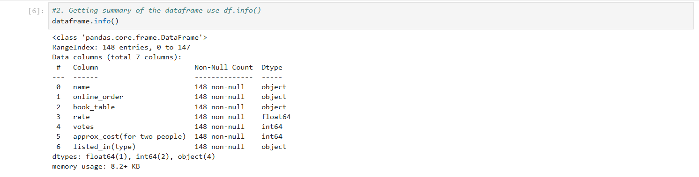
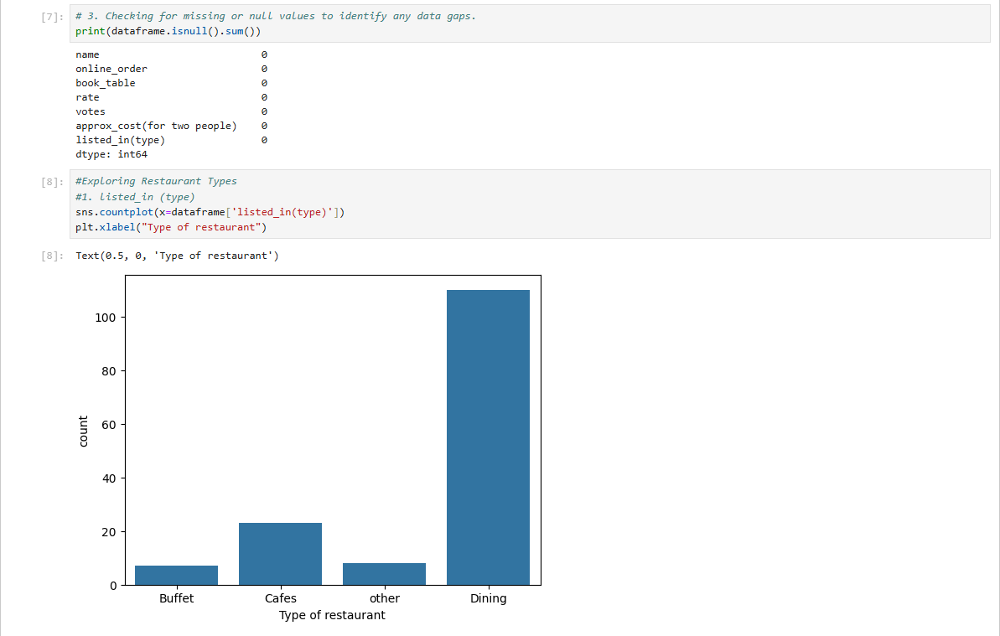
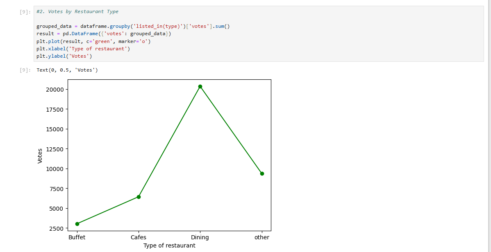
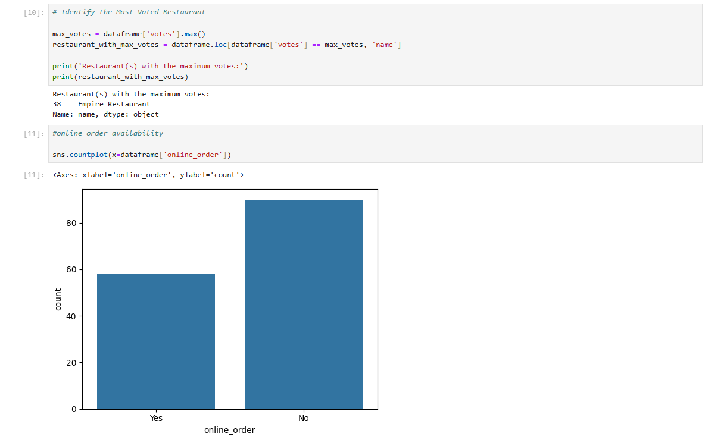
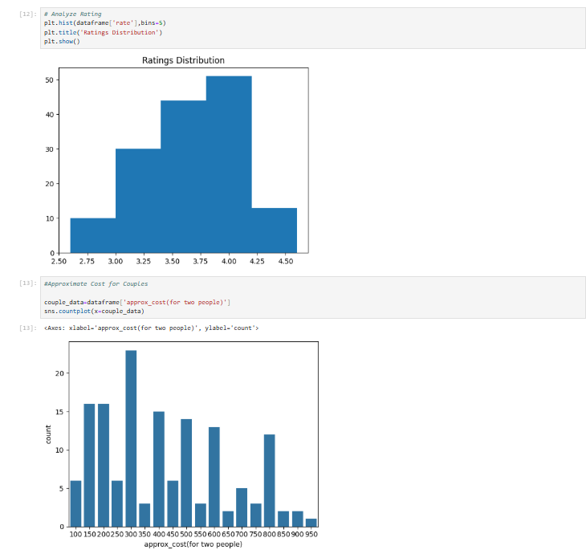
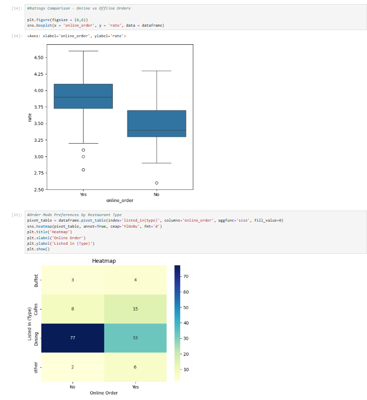

# Zomato Data Analysis Using Python

This project analyzes Zomato restaurant data using Python.  
It includes data cleaning, visualization, and insights about ratings, votes, cuisines, and restaurant trends.

## 📎 Screenshots

## 🛠️ Technologies Used
- Python  
- Pandas  
- NumPy  
- Matplotlib  
- Seaborn  
- Jupyter Notebook  

